

    

      
      &nbsp;&nbsp;&nbsp;&nbsp;&nbsp;&nbsp;&nbsp;&nbsp;&nbsp;&nbsp;
      
    

    

      
      
      
    

    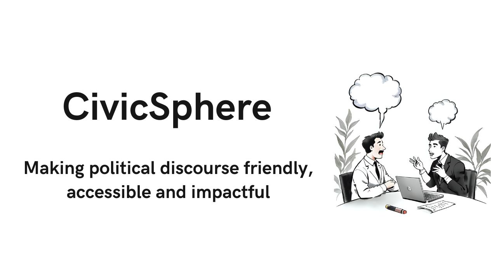
    
    &nbsp;&nbsp;&nbsp;
    
    &nbsp;&nbsp;&nbsp;
    
    

CivicSphere is an interest-based personalized platform for accessing local political information in an unified manner, focused on being inclusive, accessible and politically neutral for encouraging participation from the underrepresented communities. By leveraging tools and frameworks for ensuring accessibility in mobile-first and cloud-native manner without compromising on user privacy by adherence to responsible AI along with explainability of responses of LLM agents, the platform is grounded and compliant to privacy regulations, thus safeguarding the political interests of civilian users, enabling change in political landscape.

> NOTE: Due to high costs in using Grounding with Bing Search and high computational requirements to ensure moderation and privacy, the production site will be unavailable till December 1, 2025
> 
> For testing production, please checkout https://civicsphere.inlibre.io and use these credentials for signing in as test user. Username: testuser Password: 123456789

# Table Of Contents

1. [**Why?**](#why)
2. [**Design**](#design)
3. [**Features**](#features)
   - [Progressive Web Application](#progressive-web-application)
   - [User Preferences](#user-preferences)
   - [Chat Interface](#chat-interface)
   - [Accessibility](#accessibility)
   - [Personalized Feed](#personalized-feed)
   - [Trending](#trending)
   - [Simple and Tailored Explanation](#simple-and-tailored-explanation)
   - [Community Interaction](#community-interaction)
   - [Moderation](#moderation)
4. [**Working**](#working)
   - [Chat Agent](#chat-agent)
   - [Accessibility Features](#accessibility-features)
   - [Privacy-friendly Personalization](#privacy-friendly-personalization)
   - [Trending Content](#trending-content)
   - [Post Explanation](#post-explanation)
   - [Community Actions](#community-actions)
   - [Content Moderation](#content-moderation)
   - [Privacy and Security](#privacy-and-security)
5. [**Architecture**](#architecture)
6. [**Technologies Used**](#technologies-used)
7. [**Screenshots**](#screenshots)
8. [**Challenges**](#challenges)
9. [**Impact**](#impact)
10. [**Roadmap**](#roadmap)
11. [**Proposal**](#proposal)
12. [**Contributing**](#contributing)
13. [**Documentation**](#documentation)
14. [**Deployment**](#deployment)
15. [**Roadmap**](#roadmap)

# Why?

- **Lack of personalization in traditional channels** resulting in lack of understanding of nuances of content or local policies for civilians, resulting in passive engagement or disengagement from local policy decision making and political activities.

- **Lack of a platform for unbiased, politically neutral discussions**, especially regarding local politics on mainstream social networking and blogging sites due to polarization and invasive algorithms (for user personalization) which profiles users, breaching responsible AI practices, privacy and the user's interests.

- **Lack of accessibility and inclusion** in traditional channels due to language barriers and alternative content format, resulting in disengagement and marginalization of underrepresented people from local politics.

- **Fragmentation of political information** resulting in barriers to knowledge and understanding of local politics, causing poor political decisions and stagnancy of society due to lack of awareness and action.

# Design

## Personalization

CivicSphere aims to combat the lack of personalization in traditional channels without compromising on user's privacy or subjecting user to biased content like mainstream social networking sites by leveraging an interest-based personalization approach, which helps in delivery of hyperlocal content to end users in a community network (particular to a region). Furthermore, the platform aims to be an unified interface aggregating local political information in a centralized and easily accessible manner.

## Safety, Inclusion and Accessibility

CivicSphere aims to be a safe, welcoming and inclusive space for people to discuss and engage in local political matters in a neutral manner. Accessibility features aids in participation from underrepresented people irrespective of their background or knowledge on language or technology, thus the platform is manually tested for accessibility using screen readers such as TalkBack and Orca and content delivery style to ensure accessibility of information. The content is actively moderated for ensuring psychological safety and avoiding factually incorrect content.

## Political Neutrality

The platform should not facilitate or engage users in biased manner and the chat interface agent must provide neutral, grounded and factual responses using external knowledge sources to ensure explainability and compliance to responsible AI.

## Responsible AI and Privacy

CivicSphere is developed with responsible AI in mind, ensuring sensitive information isn't provided to LLMs and processed using custom services and that user data is used with transparency, fairness, inclusion and accountability in mind with privacy being treated as a default than a nice-to-have. This aids in protection of political interests of potentially vulnerable user population from misuse.

This fosters trust among end users, resulting in better political engagement and awareness.

# Features

## Progressive Web Application

CivicSphere is developed with a mobile-first approach to cater to several smartphone users with a responsive user interface. It can be used as a PWA (Progressive Web Application), which aids faster development for development team, offline caching for end users with capabilities of a native mobile application while eradicating the complexities with getting approval from application stores for developers. This provides a good developer experience (DX) and user experience (UX)

## User Preferences

User preferences can be configured for accessing tailored, interest-based content as personalized feeds are generated based on interests and the location of user. Community content such as posts are translated and spoken to user prefered language on demand, aiding accessibility.

## Chat Interface

An unified chat interface is provided which allows users to access specific information or query their specific doubts regarding their local community using LLMs that are grounded with external knowledge sources such as Bing and Azure AI Search containing data on local political information without compromising user privacy by PII sanitization using Azure AI Language.

The feature also integrates common prompts for improved information access in summarized manner using external data service integration for accuracy. Some of the common prompts supported by CivicSphere include accessibility and pollsite summary, common among first time voters along with trends in the user's area.

For more information on how this works, check out the [working of chat agent](#chat-agent).

## Accessibility

The application is developed to be accessible to cater people with different requirements in terms of language and content input and delivery for inclusion. CivicSphere supports text-to-speech, speech-to-text, translation to prefered language for community content interaction and creation by features such as voice posts and voice prompts which allows creation of a post via voice and prompt chat agent via voice respectively.

The interface is internationalized (i18n) to 13 languages:

1. German - de
2. Greek - el
3. English - en
4. Spanish - es
5. French - fr
6. Hindi - hi
7. Italian - it
8. Japanese - ja
9. Korean - ko
10. Polish - pl
11. Portuguese - pt
12. Russian - ru
13. Chinese - zh

For more information on how this works, check out [working of accessibility features](#accessibility-features).

## Personalized Feed

CivicSphere provides personalized user feeds based on their location (as communities are linked to location) and interests and ensures it does not predict user behavior or political alignment to ensure algorithmic neutrality.

For more information on how this works, check out [working of privacy-friendly personalization](#privacy-friendly-personalization).

## Trending

CivicSphere provides insights on recent posts pertaining to a region along with the trending topics in that particular region. This allows room for analysis of topic of interest in a dynamic manner allowing deeper understanding and engagement in local politics.

For more information on how this works, check out [working of trending content](#trending-content).

## Simple and Tailored Explanation

As CivicSphere aims to cater to users of all backgrounds irrespective of their knowledge, language or ability, we provide simplified explanation for community posts tailored to user's prefered language, their location and interests, allowing users to grasp what a certain action means for the user and how it impacts their livelihood, allowing deeper inspection.

For more information on how this works, check out [working of simpler and tailored explanation for posts](#post-explanation).

## Community Interaction

Users can engage in the community by reacting to, creating and reading community posts (which allows discourse and political engagement based on interests) or issues (which allows local listing of common issues in their surroundings) which allows them to keep in touch with recent happenings in their local communities.

For more information on how this works, check out [working of community interactions workflow](#community-actions).

## Moderation

User generated content is moderated to ensure lack of toxicity or misinformation in an automated manner for ensuring the safety of the platform using Azure Functions, Azure Content Safety and fact checking mechanisms.

For more information on how this works, check out [working of content moderation](#content-moderation).

# Working

## Chat Agent

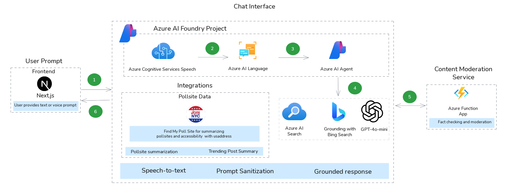

### Knowledge Base and External Data Integration

1. Azure CosmosDB is used for storing knowledge base data containing information from political websites (for now, we support NYC integrations and NYC related queries for quality control) such as [King County Voters' pamphlet](https://kingcounty.gov/en/dept/elections/how-to-vote/voters-pamphlet) for pamphlet data indexing and [NYC Votes](https://www.nycvotes.org/whats-on-the-ballot/2025-general-election/) for ballot information.
2. The data is then indexed into Azure AI Search by indexer
3. The data is used for grounding along with Grounding with Bing Search, thus returning reference URLs for verifiability
4. In addition, services are written for extraction of information from polling sites such as Find My Poll Site NYC for extracting pollsite data, something that lot of chatbots fail to do and that civilians require it most during election periods.

### User Interaction

1. A user can prompt the chat agent (Azure AI Agent) using text or voice and prompt is processed by Cognitive Services for Speech for voice.
2. Common prompts such as pollsite information invokes external services such as Find My Poll Site NYC for summarization of accessibility and details on polling to ensure smoother electoral process.
3. The chat agent is created based on user language preference for relevant grounding by Bing using Grounding with Bing Search connection tool on Azure AI Foundry along with Azure AI Search with external knowledge base.
4. The chat agent provides a grounded response after classification of intent by Azure OpenAI client with sanitized prompt using Azure AI Language for tailored response generation based on user language preference.
5. The agent and threads are deleted for privacy reasons.
6. The responses are moderated using moderation service deployed on Azure Function App.

## Accessibility Features

Accessibility features are implemented as separate components to ensure inclusive participation.

### Internationalization (i18n)

The application interface is translated to 13 different languages to cater to different language speakers using `next-intl` library
for components, pages and interactive elements' properties and attributes such as ARIA labels for maximum inclusion.

### Speech-to-text

1. The user speaks content out for voice post or voice prompt
2. The user input is captured by the browser and sent to backend for processing into WAV using ffmpeg/
3. Azure Cognitive Services for Speech is used to asynchronously recognize text from the processed content.
4. The text is then used as an input for the subsequent operations.

### Text-to-speech

1. User presses speak button on an interactive content such as post or issue.
2. The user's language preference is accounted and the JS SDK for Azure Cognitive Services for Speech is used for making a backend query for speech synthesis using Next Actions. This eliminates the need for having languages installed on the user system or reliance on proprietary browsers for the same, and works on mobile devices.
3. The content is spoken out to the end user.

### Translation

1. User presses translate button on a post.
2. The user's language preference is accounted and the post is translated from its original language to the prefered language using Azure AI Language.
3. The translated content is displayed to the end user.

## Privacy-friendly Personalization

1. User is provided with a feed based on their interests collected during onboarding along with their location.
2. The content matching their interests and location is fetched from the database and provided in reverse chronological order for users to read posts.

## Trending Content

1. User is provided with a trending section based on their location.
2. The content matching their location is fetched from the database and provided in reverse chronological order along with trending topics with ratings based on number of posts, allowing users to understand its impact in the political landscape.

## Post Explanation

1. User presses the explain section for a post in the community.
2. The user's language preference is accounted and the post content is analyzed by Azure OpenAI with LangChain for the implications of the post for the end user based on their interests, location and profession, ensuring sensitive information is not passed away.
3. The explanation along with a summary of the post is provided in user preferred language.

## Community Actions

### Post Creation

1. User can create a post in a community by providing a title, description, tags and supporting media.
2. The content is moderated by content moderation service for factual accuracy and misinformation.
3. The post is created and displayed to other users.
4. Voice posting supports posting based on voice content for improved accessibility.

### Issue Creation

1. User can create an issue in a community by providing a title, description, tags and supporting media.
2. The content is moderated by content moderation service for factual accuracy and misinformation.
3. The issue is created and displayed to other users.

### User Interactions

1. Users can upvote, downvote or comment to a post for engagement.
2. Users can upvote an issue to show support and solidarity to solve local issues by coming together.

## Content Moderation

1. The content moderation service is invoked by HTTP call when a post, issue, chat or comment has been made by an end-user.
2. The content is analyzed using Azure Content Safety for moderation along with Azure OpenAI moderation and factual accuracy is ensured using Grounding with Bing Search.
   3.The content is flagged if harmful, toxic or misleading content is found and marked as not verified if the content is not factually accurate.

## Privacy and Security

User interests and location are not used for predictive analysis of user political preferences due to privacy and responsible AI concerns. Minimal information is collected and retained to ensure working of the platform while ensuring stale data and user requests for chat are deleted in an automated manner to ensure compliance. Furthermore, data processing by external services is done over sanitized data by PII redaction to combat bias and safeguard privacy.

# Architecture

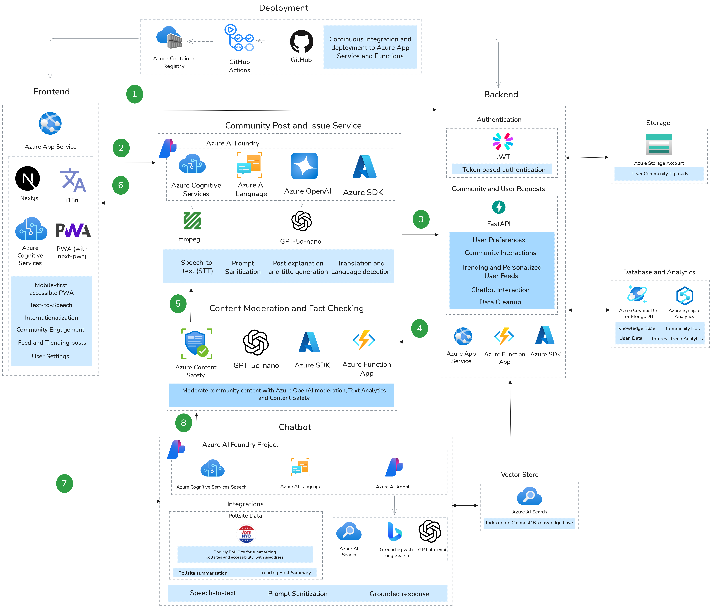

The architecture of CivicSphere is designed to support hybrid (server and serverless), cloud-native workflow for improved scalability and component-driven approach towards request handling while leveraging continuous integration and deployment for quick iterations during the development lifecycle.

# Technologies Used

- **Frontend:**

  - **Next.js** for frontend SPA framework with PWA support using `next-pwa` library.
  - **Fluent UI React** for consistent and accessible user interface components with WCAG 2.1 AA rating.
  - **`next-intl`** for internationalization (i18n) of user interface
  - **`microsoft-cognitiveservices-speech-sdk`** for client-side text-to-speech to user prefered language.

- **Backend:**

  - **FastAPI** for the API server with automatic OpenAPI integration, allowing integration with external knowledge base or usage via API management services like Azure Front Door for scalable access.
  - **LangChain** for contextual prompt evaluation using Azure OpenAI for structured and reliable prompt responses.
  - **Azure Functions** for serverless, independent and cost-effective computation and data cleaning to ensure privacy and moderate user generated content for accuracy and toxicity.
  - **Azure CosmosDB for MongoDB** for storage of unstructured data and knowledge base data, allowing processing with external data pipelines and vector storage such as Azure AI Search for automatic indexing and integration with Azure Synapse Analytics for compliant workload optimization for data-heavy operations.
  - **Azure SDK for Python** for interaction with several deployed Azure services for functionality of the application.

- **Azure:**
  - **Azure AI Foundry** for management of Azure AI Services such as Azure OpenAI (GPT-4o-mini for Azure AI Agent and GPT-5o-nano for chat completions), Azure Cognitive Services and knowledge tool management
  - **Azure Cognitive Services** for language translation, text analytics, accessibility features such as text-to-speech and speech-to-text.
  - **Azure AI Search** for vector storage of local policy data and information with embeddings for querying via the chat agent for grounded legal assistance with cases.
  - **Azure Container Registry** for storage of container images (Docker) for continuous deployment with GitHub Actions to Azure App Service.
  - **Azure App Service** for containerized, scalable and reliable deployment of web services and management of API server and function apps.

# Screenshots

| Home Page                                                                      | Home Page (with i18n to Korean)                                 |
| ------------------------------------------------------------------------------ | --------------------------------------------------------------- |
| 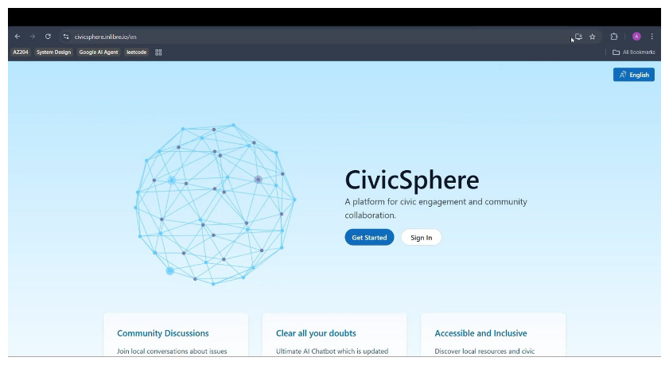                             | 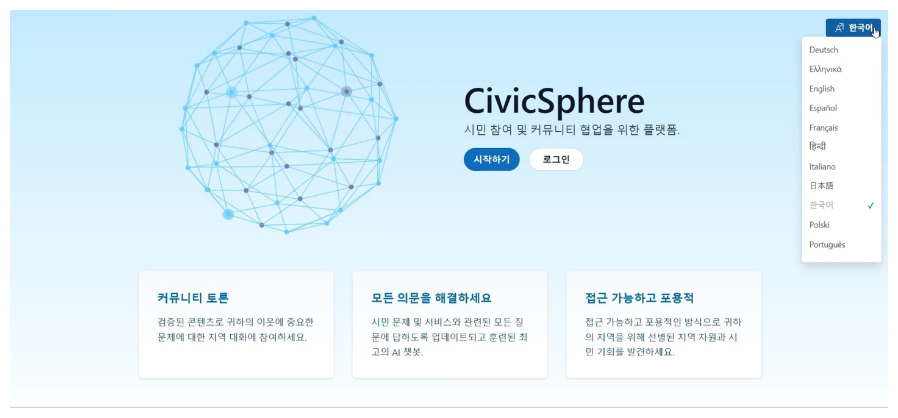 |
| User Sign Up                                                                   | User Onboarding                                                 |
| 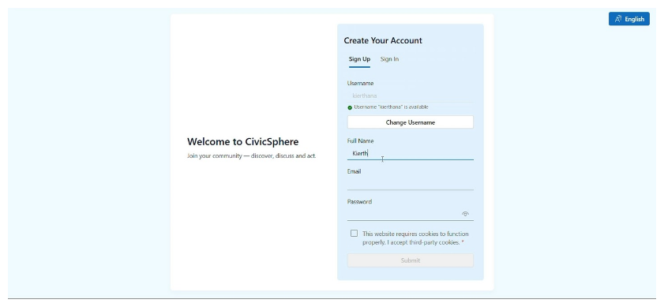                        | 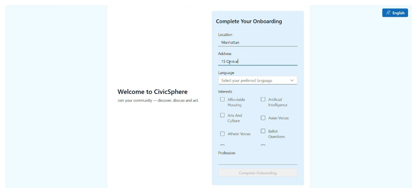           |
| Original Post Translation in Feed                                              | Trending page                                                   |
| 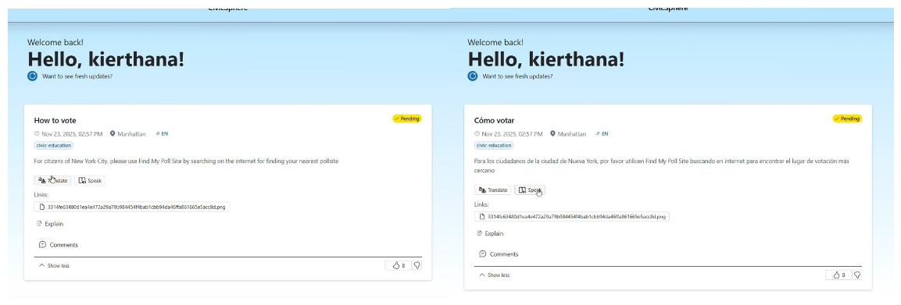 | 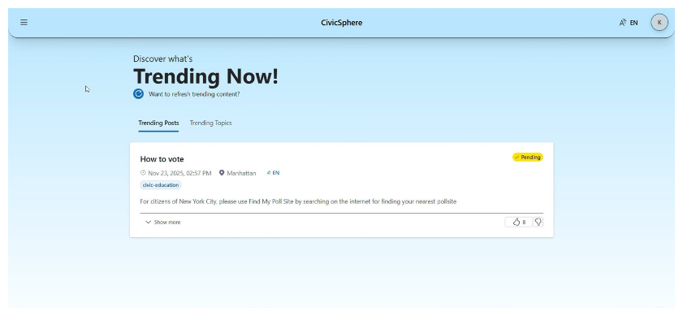          |
| Chat Interface                                                                 | Community Post                                                  |
| 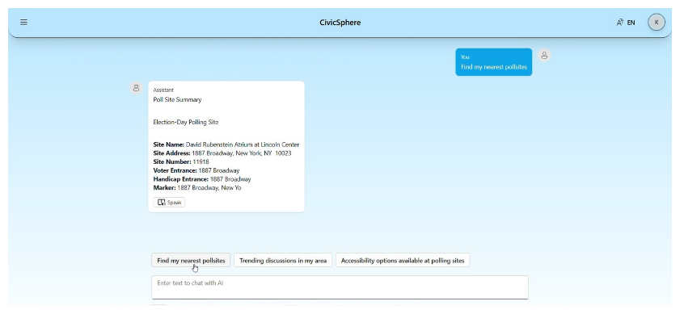                         | 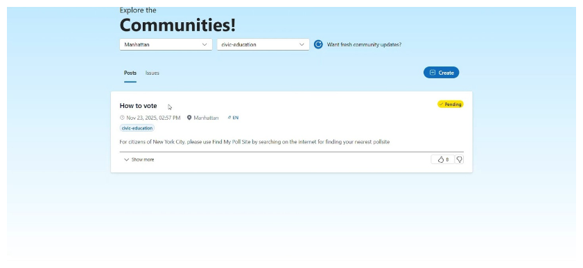  |
| Community Post Creation                                                        | Community Issue                                                 |
| 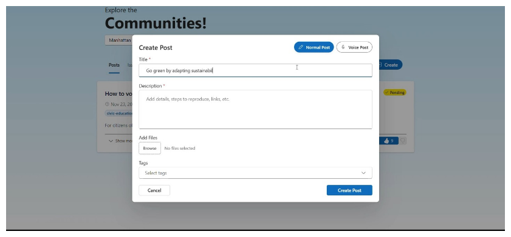            | 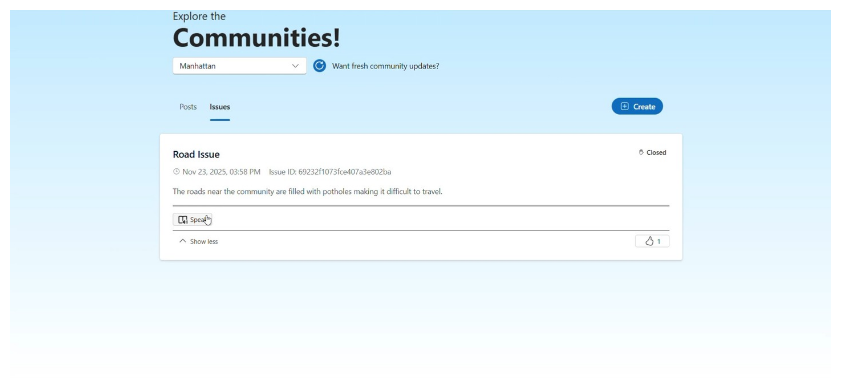  |
| Community Issue Creation                                                       | Settings                                                        |
| 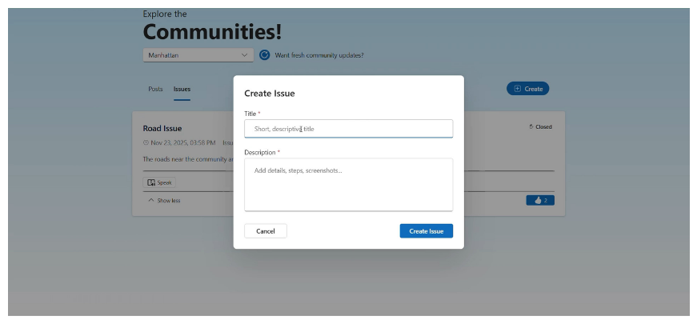       | 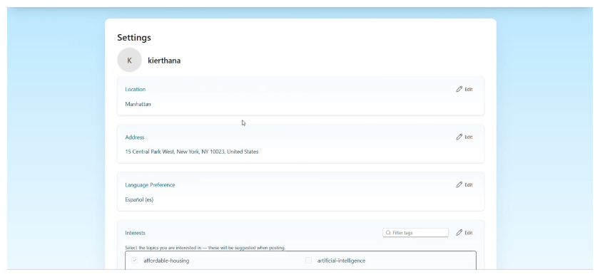         |

## Accessibility

CivicSphere is tested with Android and Orca to ensure the components are accessible and navigable using a screen reader to ensure verification along with insights from Lighthouse reports. The components are made accessible by ensuring internationalization for ARIA labels for components to prevent language barriers.

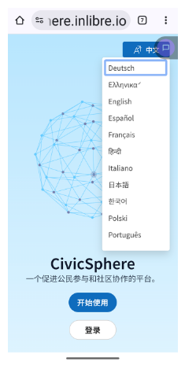

# Challenges

1. Implementing accessibility for user generated mutlimodal content such as image captioning, image summarization, document processing and translation in performant manner along with moderation for content safety.
2. Performance overhead with content moderation for community content giving rise to the need of semi-automated moderation to ensure transparency in moderation process.
3. Hallucinations despite grounding due to model-specific constraints by GPT-5o-mini.
4. Modularization of external knowledge source integrations for agnosticism in query processing for comprehensiveness.

# Impact

1. **Improved political understanding** through accessible, multi-modal, and localized information that helps communities grasp policies, civic processes, and political contexts.
2. **Increased informed political engagement** as users gain clearer insights into local policies, candidates, issues, and local developments, resulting in active and equitable civic participation.
3. **Impactful community-aided political changes** driven by decentralized participation, enabling residents to collectively identify issues and influence local governance.

# Future Enhancements

1. Implement accessibility support and performant content description services for multi-modal content to meet WCAG 2.1 AAA compliance with streamlined i18n and l10n for seamless UX.
2. Modularize local political-information aggregation using an agentic architecture to support cities beyond NYC and regions outside the USA.
3. Enable multi-modal support for documents and images with accessibility.
4. Optimize performance for improved PWA user experience while ensuring privacy compliance through minimal logging and collection of minimal data for security.
5. Integrate ActivityPub federation to enable decentralized discussions, ensure political neutrality, and align with free and open-source software principles.

# Proposal

Taking the vision and goals of https://civicchat.nyc as an inspiration, we aim to develop CivicSphere as an open-source platform for aiding civic discussions and work on accessibility integration while adhering to responsible AI standards for ensuring political neutrality and safe expression of civilian opinions and expanding it outside USA to benefit developing countries.

# Contributing

We welcome contributions for improving accessibility, internationalization, performance, adherence to responsible AI and development of services for external data aggregation in spirits of making an inclusive and open-source platform for rich and safer political engagement.

For contributing code or documentation, check [CONTRIBUTING](./CONTRIBUTING.md)

By contributing or engaging with this project, you are expected to comply with our [code of conduct](./code-of-conduct.md)

# Documentation

Check out our comprehensive project documentation at https://docs.civicsphere.inlibre.io

# Deployment

For deployment of CivicSphere for testing, please check out our [deployment documentation](./deployment/README.md)

# Roadmap

Check out the roadmap for CivicSphere at https://docs.civicsphere.inlibre.io/roadmap and track our GitHub repository for feature requests and follow through development.

# Team

- **Arun Pranav A T**:
  - [GitHub](https://github.com/arunpranav-at)
  - [LinkedIn](https://www.linkedin.com/in/arunpranavat/)
- **Keerthana Rajesh Kumar**:
  - [GitHub](https://github.com/grittypuffy)
  - [LinkedIn](https://linkedin.com/in/keerthana304)
- **R S Kierthana**:
  - [GitHub](https://github.com/KierthanaRS)
  - [LinkedIn](https://www.linkedin.com/in/kierthana-rajesh-8b8b42256/)
- **Shalini Srinivasan**:
  - [GitHub](https://github.com/ShaliniSJ)
  - [LinkedIn](https://linkedin.com/in/sjshalinisrinivasan/)
- **Vijay Ganesh S**:
  - [GitHub](https://github.com/vg006)
  - [LinkedIn](https://linkedin.com/in/vijayganeshs2006/)

# License

CivicSphere is licensed under the MIT License, thus allowing permissive usage for your needs.

For more information, check the [LICENSE](/LICENSE) file.
